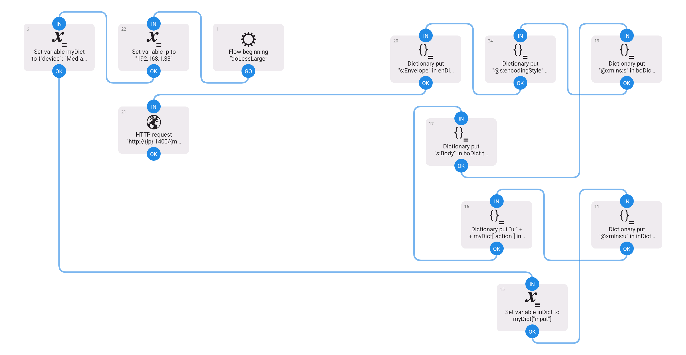

# Use AndroidTV Remote for Sonos Volume
I bought an Onn AndroidTV stick from Walmart on Black Friday for $9. I'd never otherwise use the bottom four buttons on the remote...

- YouTube
- Disney
- Netflix
- Paramount

...so I used tvQuickActions (free) to remap two of them to control my Sonos (a pair of Moves in stereo).

There's three apps I like (ordered by size, smallest-to-largest, below) that can be sideloaded to AndroidTV and that work well with tvQuickActions or any other Android button mapper app...

- Automate (Llamalab)
- HTTP Shortcuts (Waboodoo)
- MacroDroid (but not recent versions)

The files in this repository (and the screenshots) are Automate Flows for you to download. Point to them with your button mapper app and you too will have a Sonos Volume Remote. Look within the flows for where the ip variable is set -- you'll need to modify that. Enjoy!

Also works on FireTV, where my tests were with a FireTV TV (not stick or box) and the (free version of) Button Mapper (flar2) app to remap Rewind and Fast Forward. I gotta say the $9 Onn is pretty ideal tho -- once set up it can be standalone. It draws 1.7 Watts always-on, so who knows? You might have more Onns than you have TVs (cuz for example your kitchen and patio are more likely to have Sonos speakers than TVs).

## Peculiarities of Sideloaded Apps

I believe Automate will NOT need any permissions, so if it prompts and one of the choices is "Never" then choose that. Prolly cuz it's not really meant for TV, sometimes it seems to forget the flow-specific presentation of permission checkboxes which is confusing but prolly best ignored.

Please have a bluetooth mouse available for pairing with your TV whenever frustration might set in, with all these apps.

I use CX File Explorer on all my phones and TVs for creating app backups (APKs), file transfers, etc.

> Maybe sideloading is too much trouble? I understand. Your solution would be to use the paid version of a button mapper app, which tends to let you map a cURL command or http request directly instead of by pointing to a shortcut. (It's not that I'm too cheap to want the paid version -- I'm doing other complicated stuff too, so I need Automate etc no matter what.)

## UPnP

All the devices should be on the same LAN. In this repository the Sonos device ip is 192.168.1.33

Here's the cURL command for Sonos Volume Up (doMoreSmall.flo)...

```
curl -s -H "Content-Type: text/xml; charset=\"utf-8\"" \
     -H "SOAPAction: \"urn:schemas-upnp-org:service:RenderingControl:1#SetRelativeVolume\"" \
     -d '<?xml version="1.0"?>
         <s:Envelope xmlns:s="http://schemas.xmlsoap.org/soap/envelope/" s:encodingStyle="http://schemas.xmlsoap.org/soap/encoding/">
           <s:Body>
             <u:SetRelativeVolume xmlns:u="urn:schemas-upnp-org:service:RenderingControl:1">
               <InstanceID>0</InstanceID>
               <Channel>Master</Channel>
               <Adjustment>6</Adjustment>
             </u:SetRelativeVolume>
           </s:Body>
         </s:Envelope>' \
     http://192.168.1.33:1400/MediaRenderer/RenderingControl/Control
```

...and here's Sonos Volume Down (doLessSmall.flo)...

```
curl -s -H "Content-Type: text/xml; charset=\"utf-8\"" \
     -H "SOAPAction: \"urn:schemas-upnp-org:service:RenderingControl:1#SetRelativeVolume\"" \
     -d '<?xml version="1.0"?>
         <s:Envelope xmlns:s="http://schemas.xmlsoap.org/soap/envelope/" s:encodingStyle="http://schemas.xmlsoap.org/soap/encoding/">
           <s:Body>
             <u:SetRelativeVolume xmlns:u="urn:schemas-upnp-org:service:RenderingControl:1">
               <InstanceID>0</InstanceID>
               <Channel>Master</Channel>
               <Adjustment>-6</Adjustment>
             </u:SetRelativeVolume>
           </s:Body>
         </s:Envelope>' \
     http://192.168.1.33:1400/MediaRenderer/RenderingControl/Control
```

My recommendation for understanding UPnP is to experiment with a UPnP Explorer app. For Android that's UPnP Explorer, if you're on iPhone I believe uPnP Mate would be your go-to (and there's no need to perform UPnP exploring from a TV).

I'ma provide a description of the flow logic later. For now just feel free to inspect the flows STARTING with the dictionary object variable myDict and/or myObj. It represents the UPnP device/service/action that a UPnP Explorer deep-dive shows.

## Whimsical Remotes

Since a dial knob (like any 2000-era car radio would have) is universally regarded as a simple volume control, that's a worthy component of an ideal Sonos remote. Mouse scrollwheels are so common and inexpensive, so let's brainstorm. 

Just type into AI: ubuntu remap mouse wheel to perform http request

In minutes you have Bluetooth Mouse Wheel Volume! I tested on my X11 window-managed system, all it needs is xbindkeys and two shell scripts (each would just be one cURL command, see above).

Works great, very fast. There are unintended consequences, so I'ma characterize as whimsical. I bet folks running Raspberry Pis anyway, can proceed. Bluetooth mice are about $9 too, heh.

Next I tried Kodi. Again very easy via userdata/keymaps. But way too slow to be usable, based on tests with a FireTV TV, and also with an Onn AndroidTV stick.

Last but not least, did you know that the Spotify apps that smart TVs have don't really present the Spotify Connect functionality to the user? So it's kinda fun to sideload a phone version of Spotify to test. You guessed it! The phone versions cause your phone's volume buttons to be Sonos volume buttons. And the same tends to be true with your TV remote if that sideloaded Spotify is in the foreground of your FireTV. Woah! Even with the TV "off" in my case.



---
